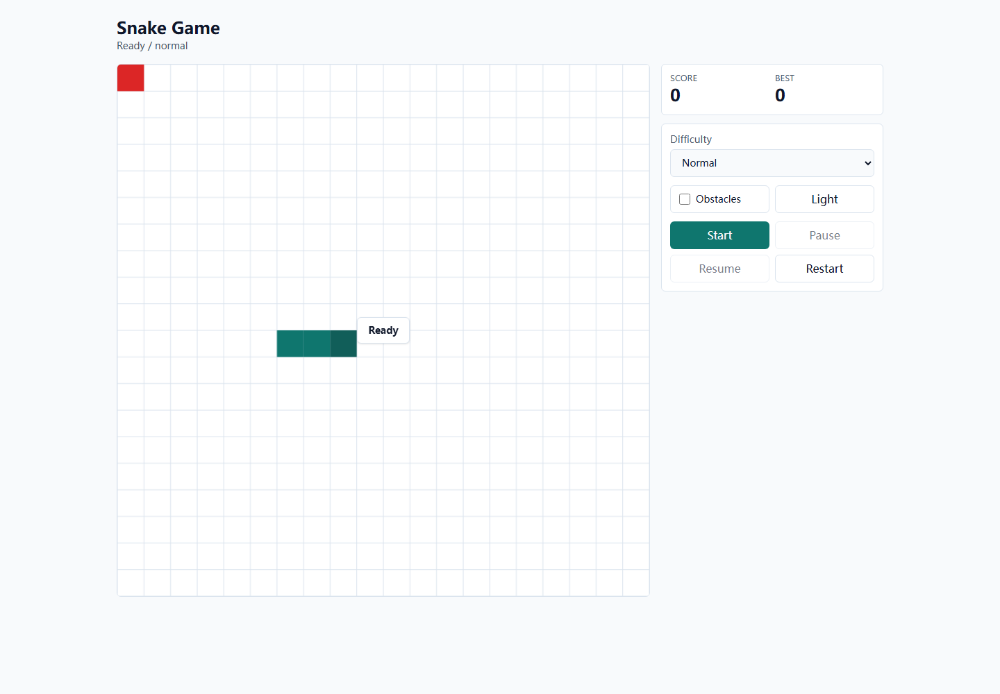
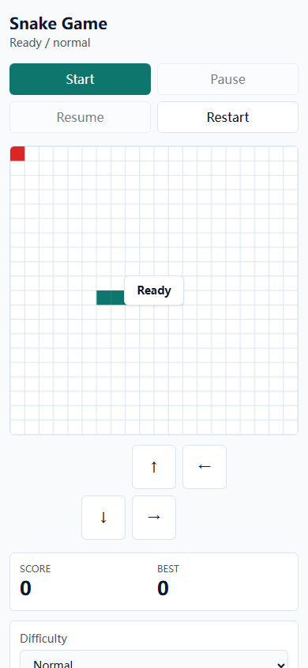

# Snake Game Web

A modern minimal Snake game built as a responsive single-page app for desktop web and H5 mobile screens.

## Screenshots

### Desktop



### H5 Mobile



## Core Features

- Canvas-based Snake board rendering.
- Desktop keyboard controls with arrow keys and WASD.
- H5 controls with touch buttons and swipe gestures directly on the board.
- Start, pause, resume, and restart game actions.
- Difficulty levels: easy, normal, and hard.
- Optional obstacle mode.
- Score and best score tracking.
- Best score persistence through `localStorage` with safe fallback.
- Speed progression as food is collected.
- Light and dark theme support with CSS variable tokens.
- Store-managed difficulty, theme, score, and best score state.
- Responsive SPA layout for desktop and mobile.

## Tech Stack

- Vite 8
- React 19
- TypeScript 6
- Tailwind CSS v4
- Zustand
- Vitest
- Canvas 2D API

## Getting Started

Install dependencies:

```powershell
pnpm install --store-dir D:\.pnpm-store
```

Start the development server:

```powershell
pnpm dev
```

Build for production:

```powershell
pnpm build
```

Run tests:

```powershell
pnpm test
```

## Project Structure

```text
src/
  components/        React UI components
  hooks/             Game controller hook
  lib/game/          Pure game engine and Canvas renderer
  store/             Zustand store for difficulty, theme, and scores
  test/              Vitest setup
```

## Notes

- The game engine is pure TypeScript and does not depend on React or Canvas.
- Canvas rendering reads theme colors from CSS variables, so future themes can be added without changing game rules.
- Mobile users can play with either on-screen direction buttons or swipe gestures on the board.
